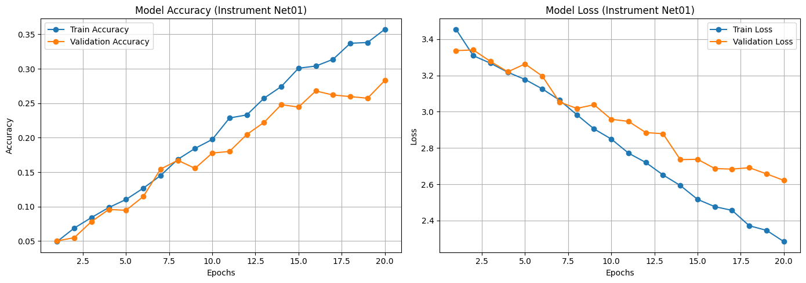
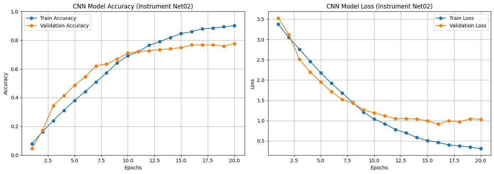
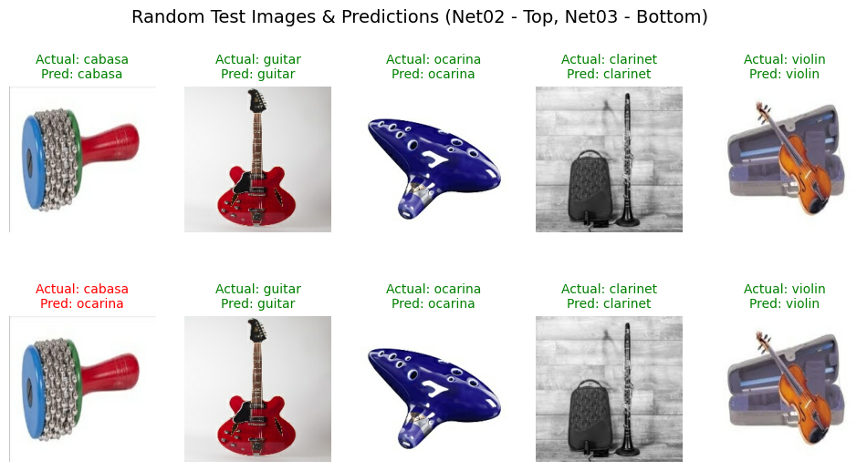

# Musical Instrument Image Classification (CNN)

## 📌 Overview
Convolutional neural networks (CNNs) for classifying images of musical instruments.  
This notebook includes jointly written setup code at the start, a teammate’s section on **“Unsupervised Learning: Dimensionality Reduction & Clustering,”** and **my work from the header “Data Preprocessing and Dataset Preparation for Simple and Advanced CNN” through the end** (preprocessing, model building, tuning, and evaluation).

The Jupyter Notebook is in `notebooks/`, and model performance visuals are in `visuals/`.

## 🛠️ Tools & Libraries
- **Python:** NumPy, Matplotlib  
- **Deep Learning:** TensorFlow / Keras

## 🔧 My Contributions (end-to-end DL section)
- **Data preprocessing:** normalized/reshaped images; built batched `train_dataset` and `valid_dataset`.
- **Class imbalance:** applied **`class_weight`** in `model.fit(...)`.
- **Early stopping:** used a **Keras `EarlyStopping` callback** on **`val_loss`** with best-weights restore.
- **Model development (Keras):**
  - `instrument_net01` — baseline CNN
  - `instrument_net02` — deeper/advanced CNN
  - `instrument_net03` — tuned variant (RMSprop with reduced LR + dropout)
- **Evaluation:** trained with explicit **`validation_data=valid_dataset`**; tracked **`accuracy` / `val_accuracy`** and **`loss` / `val_loss`**.

## 📊 Key Results
- Best-performing model: **`instrument_net03`**
- Achieved **~90% training accuracy** and **~76% validation accuracy** (early stopping on `val_loss`).
- Dropout and optimizer tuning improved generalization compared to `net01`/`net02`.

## 📷 Visuals
- **Baseline Model (Net01):**  
  

- **Intermediate Model (Net02):**  
  

- **Net02 vs Net03 Comparison:**  
  

- **Prediction Samples (Net02 vs Net03):**  
  

## 🤝 Collaboration Notes
- **Co-authored:** Initial setup code before the “Unsupervised Learning” section.  
- **Teammate:** “Unsupervised Learning: Dimensionality Reduction & Clustering.”  
- **Mine:** From **“Data Preprocessing and Dataset Preparation for Simple and Advanced CNN”** to the end (all CNN work).

---
