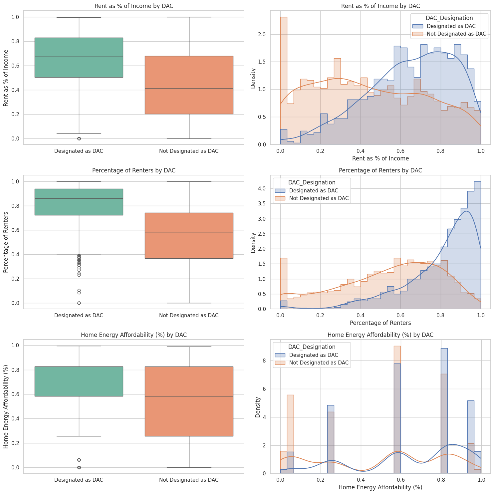
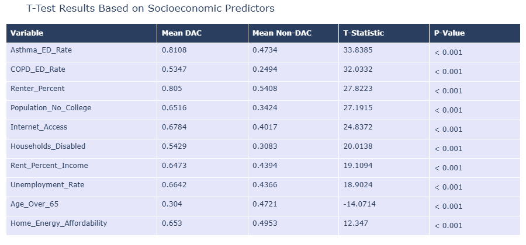
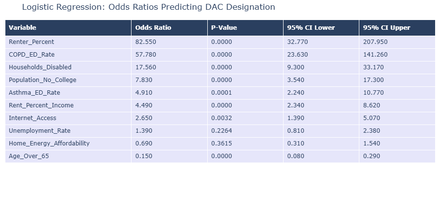
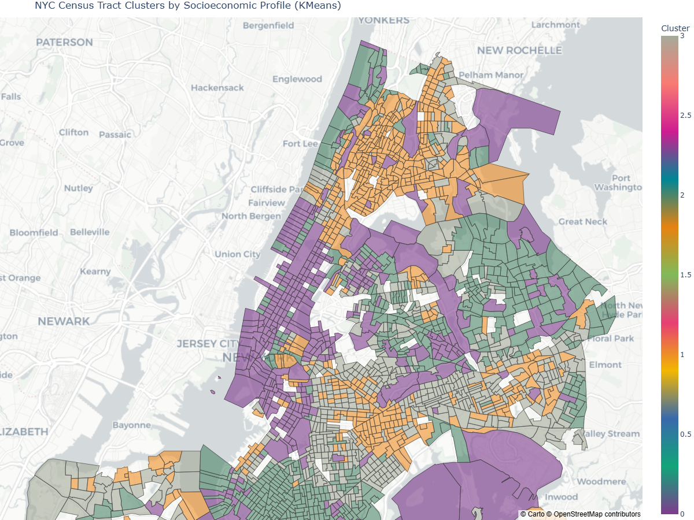

# Identifying and Addressing Transit Deserts in the Bronx

## 📌 Overview
This project explores socioeconomic disparities in New York City census tracts to identify and characterize **Disadvantaged Communities (DACs)** and their relationship to transit accessibility. Using data from the **U.S. Census Bureau** and the **New York State Climate Justice Working Group**, I performed **exploratory analysis, statistical testing, logistic regression, and clustering** to uncover the factors most predictive of DAC status.

The Jupyter Notebook is available in the `notebooks/` folder, and key figures are provided in the `visuals/` folder.

## 🛠️ Tools & Libraries
- Python (Pandas, NumPy, Plotly, Matplotlib, Seaborn)
- SciPy, statsmodels (Welch’s t-tests, logistic regression)
- scikit-learn (KMeans clustering)
- GeoPandas, TIGER/Line shapefiles, Plotly Choropleths

## 🔍 Key Methods
- **Exploratory Data Analysis**: Visualized socioeconomic indicators such as rent burden, internet access, and education levels across DAC and non-DAC tracts.
- **Statistical Testing**: Applied Welch’s t-tests to compare DAC vs. non-DAC means for 10+ variables (e.g., renter %, COPD ED visits, education).
- **Logistic Regression**: Modeled DAC designation using socioeconomic predictors, identifying **Renter %** and **COPD ED Rate** as the strongest factors (McFadden’s R² ≈ 0.541).
- **Unsupervised Learning**: Applied **KMeans clustering** to group census tracts by socioeconomic profiles, revealing distinct clusters of disadvantage across NYC.

## 📊 Key Results

### Socioeconomic Differences

### T-Test Results

### Logistic Regression Odds Ratios

### KMeans Clustering Map

## 🚀 Impact
- Highlighted that **renter concentration and chronic respiratory illness** are strong predictors of DAC status.  
- Identified structural inequities in the Bronx relative to other boroughs, providing data-driven evidence for **transit and infrastructure planning**.  
- Demonstrated how **machine learning and statistical methods** can be applied to urban policy challenges.  

## 📄 Full Report
For the complete methodology, results, and policy discussion, see the final paper:  
👉 [Final Capstone Report (PDF)](https://drive.google.com/file/d/1jwwk2yvnRWvQFCX13ySr3R4xkuq5tHvn/view?usp=drive_link)

---
